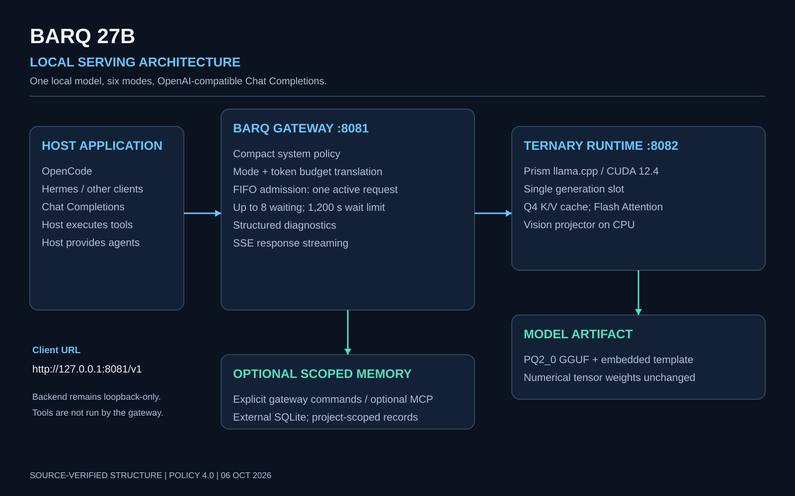
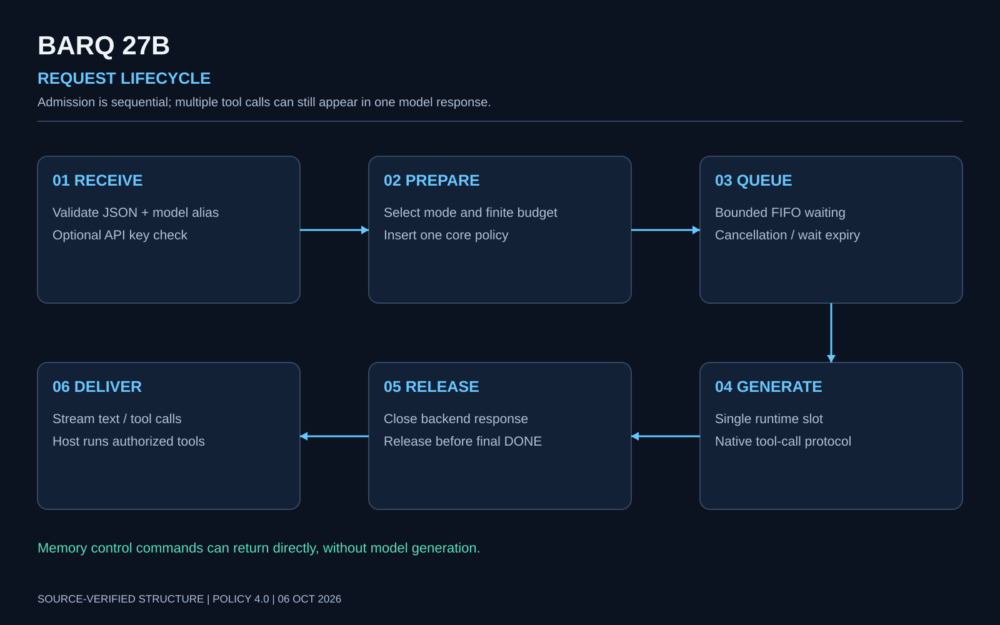
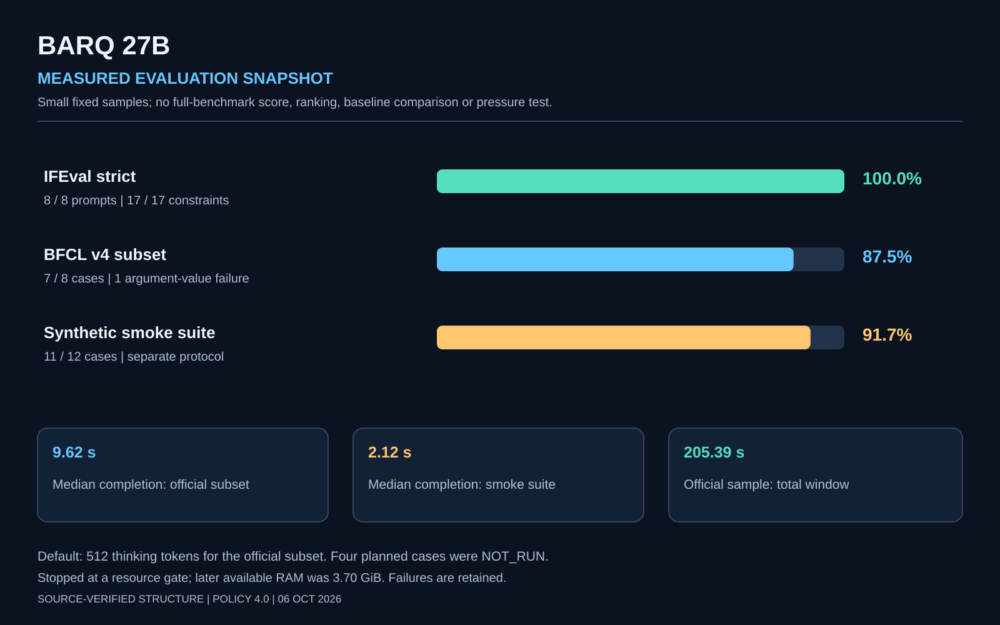

# Barq 27B

[](README.ar.md) [](README.en.md)

**A local derivative serving distribution with explicit reasoning controls and reproducible evaluation evidence.**

Barq adds an original compact system policy, a GGUF chat-template wrapper, six
reasoning modes, FIFO admission and project-scoped external memory. It preserves
the numerical tensor weights of the upstream model. Tools and agents come from
the host application; a system prompt does not create unavailable capabilities.
[Origin and licenses](../legal/NOTICE.txt).

## Architecture



| Component | Responsibility |
|---|---|
| Client | Conversation, actual tools, approvals and any real agents |
| Barq gateway, :8081 | Core policy, mode/budget mapping, FIFO, optional memory and SSE |
| Prism ternary runtime, :8082 | GGUF inference, native function-call protocol and token generation |
| GGUF | Numerical weights and embedded Barq template |
| Memory store | External SQLite records scoped to a selected project |

The gateway implements `/v1/models` and `/v1/chat/completions`. It does not provide
Responses or Anthropic Messages transport. Both services bind to loopback. Connect
clients to :8081 to retain Barq mode ceilings, queueing and gateway memory.

## Local setup

The supplied launcher targets **Windows x64, Python 3.10+ and NVIDIA CUDA**. The
serving Python code uses the standard library. Cross-platform endpoint clients
can connect, but a Linux/macOS launcher is not supplied or validated here.

### Existing Barq installation

Keep the existing GGUF and runtime in place. Close the previous server yourself
before starting a new one. This launcher refuses a second llama-server and never
stops an unrelated process.

```powershell
powershell.exe -NoProfile -ExecutionPolicy Bypass -File "D:\Barq 27B\Start-Barq.ps1" -Context 262144
```

The terminal shows model, policy, runtime, context and runtime/API diagnostics.
Wait for model-loaded/listening messages; an API banner alone does not confirm
that the weights finished loading. Keep the terminal open. Ctrl+C ends only the
processes owned by that launch.

### New installation from this repository

Download the repository ZIP and extract it, for example, to `D:\Barq 27B`.
Obtain the [pinned runtime](../runtime/README.md) and [upstream model/projector](../models/README.md)
separately; large binaries are not stored here. Prepare a new policy-embedded model:

```powershell
cd "D:\Barq 27B"
python .\tools\Prepare-Barq.py --source-model "D:\Downloads\Ternary-Bonsai-2-27B-PQ2_0.gguf" --source-projector "D:\Downloads\Ternary-Bonsai-2-27B-mmproj-Q8_0.gguf"
powershell.exe -NoProfile -ExecutionPolicy Bypass -File ".\Start-Barq.ps1" -Context 32768
```

Preparation writes new artifacts, checks the expected tensor payload hashes and
creates a matching installation manifest. It does not run inference or download
files automatically. It refuses existing destinations. The evaluated local
artifact's full hash is recorded; a rebuild can differ in metadata layout while
preserving the same tensor payload. Preparation is statically checked in this
publication; rebuilding multi-gigabyte files was not repeated during publication.

Start with 32,768 context for a new machine; increase only with available resources.
262,144 is the supported launcher ceiling, not proof of good quality or speed
with a fully occupied context. Match the client's advertised context to the value
actually launched. Readiness can be inspected without generating an answer:

```powershell
Invoke-RestMethod "http://127.0.0.1:8081/v1/models"
```

## Six reasoning modes

| Mode | Model ID | Native effort | Thinking-token ceiling |
|---|---|---|---:|
| Default | `Barq-27B` | medium | 2,048 |
| Low | `Barq-27B-Low` | low | 512 |
| Medium | `Barq-27B-Medium` | medium | 2,048 |
| High | `Barq-27B-High` | xhigh | 8,192 |
| Xhigh | `Barq-27B-Xhigh` | xhigh | 16,384 |
| Max | `Barq-27B-Max` | xhigh | 24,576 |

These are ceilings, not target response lengths or promised durations. An explicit
smaller budget is honored; `-1` does not bypass the selected mode cap. The gateway
may reduce thinking further to reserve final-answer tokens. To allow the full
Max ceiling, a 32,768 total output allowance is sufficient under the current reserve rule.
Higher modes are intended for difficult work; easy questions should be answered
directly. No full-budget comparison of all six modes has been measured.

Selecting the model alias is the most portable way to choose a mode across
applications. Advanced clients can also send `barq_mode` or `X-Barq-Mode`.
Default/Low suit quick work; High and above trade a larger permitted budget for
potentially longer execution. A larger budget is not a guarantee of correctness.

## OpenCode

Merge [the portable provider example](../clients/OpenCode-Barq.example.json) into
your OpenCode configuration; retain unrelated providers and settings. It uses
`@ai-sdk/openai-compatible` with `http://127.0.0.1:8081/v1`. Open `/models`, choose
the Barq provider, then select the desired alias, such as `Barq-27B-High`.
The example lists all six models directly, avoiding reliance on custom variant
fields being forwarded by a particular SDK version. It does not auto-enable MCP.
If you launch 32,768 context, change every example `limit.context` accordingly.
OpenCode operation was reported successful by the maintainer; the publication
checks configuration structure without launching another model test.
[Official provider documentation](https://opencode.ai/docs/providers/).

## Hermes

Run `hermes model`, select a **Custom endpoint**, and enter:

| Field | Value |
|---|---|
| Base URL | `http://127.0.0.1:8081/v1` |
| Model | `Barq-27B` or a mode alias, e.g. `Barq-27B-High` |
| API mode | `chat_completions` |
| API key | Empty for the default local gateway |

Alternatively merge [the YAML example](../clients/Hermes-Barq.example.yaml) into
`~/.hermes/config.yaml`, preserving other settings. Start a new session after
changing the default. Use aliases for exact Barq modes. This is a documented
integration recipe; Hermes end-to-end testing has not been performed in these
recorded runs. If Hermes is in WSL or on another device, verify that its loopback
reaches the Windows service; the supplied launcher does not expose a LAN listener.
[Official custom-provider documentation](https://hermes-agent.nousresearch.com/docs/integrations/providers).

For another compatible app, use the same endpoint and aliases, and require Chat
Completions transport. A real `BARQ_API_KEY`, if configured, belongs in the client's
secret store or environment. Never paste it into a committed example.

## Request handling



One model generation runs at a time. Up to eight requests can wait in FIFO order
for at most 1,200 seconds. Ordinary overlapping requests queue; saturation can
still return 429 and wait expiry can return 503. Client timeouts must cover both
queue wait and generation. Admission is released before the final SSE DONE or
JSON response, allowing immediate tool follow-ups. No simultaneous-load test is
claimed by the sequential evaluations.

## Memory without mandatory MCP

The gateway offers explicit commands through ordinary Chat Completions messages:

```text
/barq-memory help
/barq-memory use D:\YourProject
/barq-memory status
/barq-memory save {"key":"architecture","title":"Architecture","content":"Approved decision","category":"decision"}
/barq-memory search {"query":"architecture"}
/barq-memory off
```

Send one complete command per user message. Memory is external, local plaintext
SQLite storage, not a change to weights. The project path selects scope; it does
not ingest project files. Ordinary conversation is not automatically saved and
model output cannot execute memory-control commands. Scope must remain in history
or be explicitly supplied again after compaction. MCP is an optional interface
to the same store; its example is separate and requires edited local paths.
This is logical project scoping, not a multi-tenant security guarantee.

## Hardware and capacity

| Profile | Hardware | Evidence/status |
|---|---|---|
| Recorded machine | RTX 5060 Ti, 16,311 MiB VRAM; i7-14700K; 31.69 GiB RAM | Official-data subset ran here; not full-context testing |
| More headroom | 24 GB+ NVIDIA GPU, 64 GB RAM, modern multicore CPU, NVMe SSD | Capacity planning estimate; not benchmarked |
| CPU-only / smaller GPU | Requires a different runtime/launcher configuration | Not validated by this release |

The model is about 6.71 GiB and the projector about 0.59 GiB. Allocate additional
space for KV cache, compute buffers, runtime and applications. Plan at least
25 GB free disk when retaining downloads and producing new GGUF files; that is
a workspace allowance, not the installed model size. A high context allocation
can exhaust RAM even when weights fit VRAM. The recorded round stopped at the
resource gate; a later reading was 3.70 GiB available RAM. Do not infer guaranteed
262k throughput or buy hardware solely from this small test.

## Measured evaluations



| Run | Result | Median completion | Limits |
|---|---|---:|---|
| IFEval subset | strict/loose: 8/8 prompts; 17/17 constraints | Combined official subset: 9.617 s | Default; 512 thinking; 2,048 output |
| BFCL v4 subset | 7/8 cases; single 4/4, multiple 1/2, parallel 2/2 | Same combined run | No actual tool execution |
| Synthetic smoke | 11/12 custom cases | 2.1165 s | 128 thinking; 512 output; 60 s per request |

The official-data window was 205.391 seconds, with 194.813 seconds summed request
time, 7,308 reported completion tokens and zero transport/scorer errors or truncated
responses. Four of twenty selected cases were NOT_RUN, including irrelevance.
BFCL's failed location argument included the hotel name where the reference
accepted the city only; it remains a failure. The smoke failure was an exact
wording mismatch for a clarification question and remains a failure too.
Max in the smoke suite had a 128-token thinking limit; it is not a full-Max result.
No A/B baseline, complete leaderboard score or general performance superiority
is established. [Raw evidence, methods and offline reproduction](../evaluations/README.md).

## Future development

God willing, Barq will continue to develop: tool-argument precision, broader held-out
evaluations, scoped-memory validation, client coverage and reasoning efficiency.
These are plans, not shipped capabilities or promised scores. [Roadmap](ROADMAP.md).
